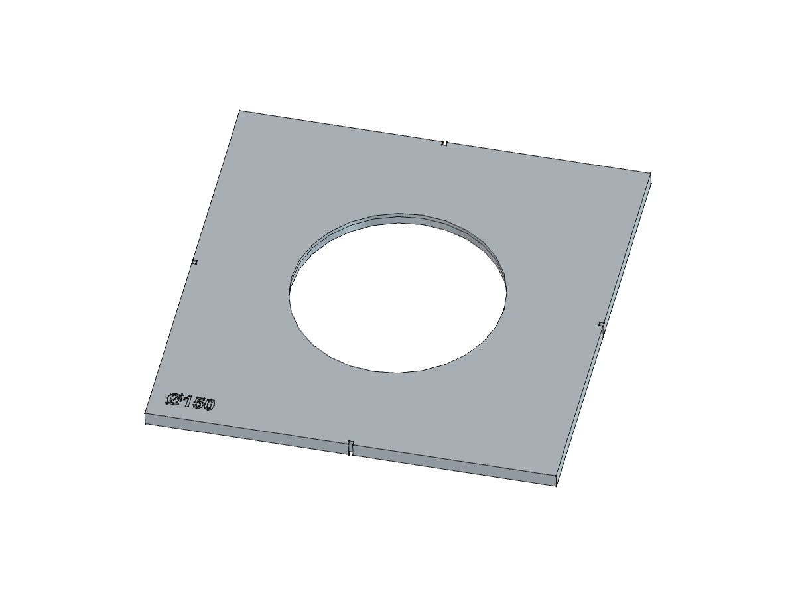

# CircleInlayRouterJig

Parametric, 3D-printed router template for cutting a circular inlay recess with a
**top-bearing pattern bit**. It's sized to fit a **laser-cut** inlay disc. Built in FreeCAD 1.1.

The bit's bearing rides the template's hole wall, and the cutter below it cuts the recess.
An underside relief keeps the cutter off the plastic, so only the bearing touches the
template. Set the disc diameter and thickness plus your bit's measurements, and the
template is derived automatically:

```
Recess        = InlayDiameter − LaserKerf + 2·InlayFitClearance
TemplateHole  = Recess + BearingOD − CutterDiameter
TemplateThick = CutterLength − RecessDepth + BearingStackHeight − CollarGap
```

Sizes planned: Ø100, Ø150, Ø200 (single piece on a 350 mm bed), for 3.1–3.2 mm thick discs. Ø250 is on the backlog.

## Status

Plan rev 2 approved, and the model was built 2026-10-08 (Ø150 default; audit clean; flex-tested at Ø100/150/200). Not yet test-printed.



## Layout

| Path | Contents |
|---|---|
| `Params.FCStd` | VarSet holding every parametric variable (created by `macros/00-bootstrap_params.FCMacro`) |
| `CircleInlayRouterJig.FCStd` | The template model |
| `intent.md` / `plan.md` | Design goal / approved modeling plan |
| `macros/` | FreeCAD macros that make all model changes |
| `scripts/audit_parametric.py` | Parametric-integrity audit; run it before every commit |
| `stl/`, `3mf/` | Print deliverables |
| `gcode/` | Slicer output (gitignored) |
| `images/` | Photos and renders |

## Usage

1. Measure your bit (cutter Ø and length, bearing Ø, bearing stack height) and your disc
   (diameter, thickness). Enter them in `Params.FCStd`.
2. Recompute `CircleInlayRouterJig.FCStd` and export `RecessTemplate`.
3. Print **top face down** in PETG-rCF (or similar), with elephant-foot compensation on.
   Check the hole with calipers and tune `TemplateHolePrintComp` if needed.
4. Tape the template to the workpiece, aligning the edge notches to your layout lines.
5. Set the bit depth to the disc thickness and rout in **one full-depth pass**, keeping the
   bearing against the wall. A shallower pass would cut into the template.
